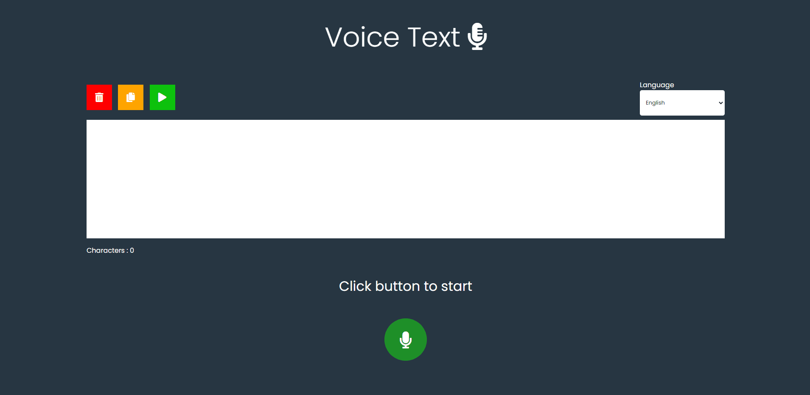

<h1>Voice Text</h1>

## About

### The application allows the user to transform their audio into text, made with <a href="https://developer.mozilla.org/en-US/docs/Web/API/Web_Speech_API">Web Speech API</a> and <a href="https://developer.mozilla.org/en-US/docs/Web/API/SpeechRecognition">SpeechRecognition API</a>

## How to run

### Open the console in the project folder and type <code>node server.js</code>, then open the browser in <code>localhost:3000</code>

## 🚀 Technologies

<ul>
    <li>Node.js</li>
    <li>Javascript</li>
    <li>html</li>
    <li>css</li>
</ul>

Made by João Pedro
